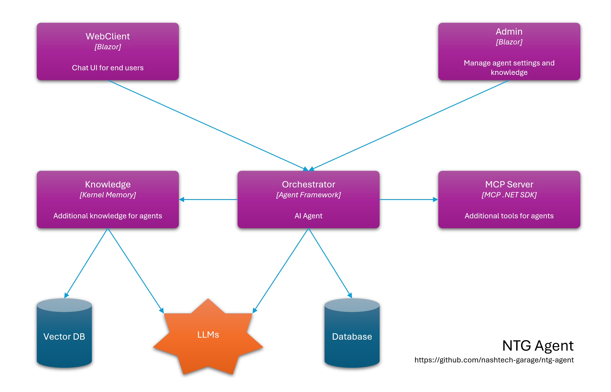

# NTG Agent
This project aims to practice building a chatbot in C#

[](https://github.com/nashtech-garage/ntg-agent/actions/workflows/ntg-agent-ci.yml)
[](https://sonarcloud.io/summary/new_code?id=nashtech-garage_ntg-agent)
[](https://sonarcloud.io/summary/new_code?id=nashtech-garage_ntg-agent)
[](https://sonarcloud.io/summary/new_code?id=nashtech-garage_ntg-agent)
[](https://sonarcloud.io/summary/new_code?id=nashtech-garage_ntg-agent)


## High level architecture



## Technologies and frameworks
- .NET 10
- .NET Aspire
- Blazor
- Microsoft Agent Framework
- Kernel Memory
- Support multiple LLMs: GitHub Models, Open AI, Azure Open AI etc.
- SQL Server

## Documentation
Details about the project can be referenced at DeepWiki: https://deepwiki.com/nashtech-garage/ntg-agent

## Getting started

- Setup [GitHub models](https://docs.github.com/en/github-models/use-github-models/prototyping-with-ai-models) (free): Create your Fine-grained personal access tokens in GitHub https://github.com/settings/personal-access-tokens. The token needs to have **models:read** permissions.
- Update file secrets.json for the NTG.Agent.Knowledge with content below Or run the cli command `dotnet user-secrets set "KernelMemory:Services:OpenAI:APIKey" "<your_token_here>"`. Read [this link](https://learn.microsoft.com/en-us/aspnet/core/security/app-secrets) if you don't know how to set the secrets


```json
{
  "KernelMemory": {
    "Services": {
      "OpenAI": {
        "APIKey": "your GitHub token"
      }
    }
  }
}
```

- In the NTG.Agent.MCP.Server project, add your Google SearchEngineId and ApiKey
following https://developers.google.com/custom-search/docs/tutorial/creatingcse in the secrets.json as below

```json
{
    "Google": {
      "ApiKey": "<your google cse Api Key>",
      "SearchEngineId": "<your google cse Search EngineID>"
    }
}
```

- The default database connection string is `Server=.;Database=NTGAgent;Trusted_Connection=True;TrustServerCertificate=true;MultipleActiveResultSets=true` which connect to the local SQL server instance using Windows Authentication. If your environment is different, update the connection string in appsettings.Development.json files of three projects: NTG.Agent.Admin, NTG.Agent.Orchestrator, NTG.Agent.Knowledge

- In the NTG.Agent.Admin project, open the terminal and run `dotnet ef database update`. Repeat the same for the NTG.Agent.Orchestrator project.

- Run the NTG.Agent.AppHost, in the Aspire Dashboard you will see resource as below:
  - NTG.Agent.WebClient is the website for end users
  - NTG.Agent.Admin is the website for administrators. The default admin account is admin@ntgagent.com / Ntg@123
  - NTG.Agent.Orchestrator is the backend API
  - NTG.Agent.Knowledge is the service responsible for ingesting documents. It extracts the content of uploaded files, generates embeddings, and stores them in a vector database. It also provides an API to search for relevant documents

- Open the NTG.Agent.Admin --> Agent Management --> Agent Default and update the Agent Provider with GitHub Model information that you created earlier. 
  - Provider Name: GitHub Model
  - Provider Endpoint: https://models.github.ai/inference
  - Provider API Key: Your GitHub token
  - Model Name: openai/gpt-4.1 or other model that GitHub model supports

## How authentication work

To get started easily, we use the shared cookies approach. In NTG.Agent.Admin, we add YARP as a BFF (Backend for Frontend), which forwards API requests to NTG.Agent.Orchestrator.
Currently, it only works for Blazor WebAssembly. Cookies are not included when the request is made from the server (Blazor).

## Contributing

- Give us a star
- Reporting a bug
- Participate discussions
- Propose new features
- Submit pull requests. If you are new to GitHub, consider to [learn how to contribute to a project through forking](https://docs.github.com/en/get-started/quickstart/contributing-to-projects)

By contributing, you agree that your contributions will be licensed under Apache-2.0 license. 


