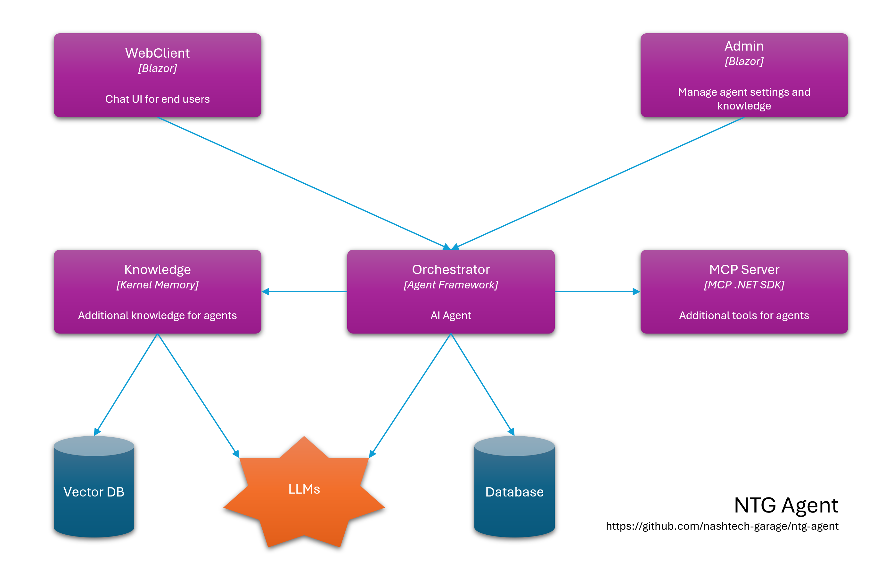

# NTG Agent
This project aims to practice building a chatbot in C#

[](https://github.com/nashtech-garage/ntg-agent/actions/workflows/ntg-agent-ci.yml)
[](https://sonarcloud.io/summary/new_code?id=nashtech-garage_ntg-agent)
[](https://sonarcloud.io/summary/new_code?id=nashtech-garage_ntg-agent)
[](https://sonarcloud.io/summary/new_code?id=nashtech-garage_ntg-agent)
[](https://sonarcloud.io/summary/new_code?id=nashtech-garage_ntg-agent)


## High level architecture



## Technologies and frameworks
- .NET 10
- .NET Aspire
- Blazor
- Microsoft Agent Framework
- Kernel Memory
- Support multiple LLMs: GitHub Models, Open AI, Azure Open AI etc.
- SQL Server

## Documentation
Details about the project can be referenced at DeepWiki: https://deepwiki.com/nashtech-garage/ntg-agent

## Getting started

Run the project **locally with .NET Aspire**.

The AppHost orchestrates everything: it starts a SQL Server container, runs EF migrations for Admin and Orchestrator, then launches all 5 services with service discovery and config wiring. No local SQL Server install required.

Prerequisites: [.NET 10 SDK](https://dotnet.microsoft.com/download), Docker (used by Aspire to run the SQL Server container), and the `dotnet-ef` global tool:
```bash
dotnet tool install --global dotnet-ef
```

1. Create a [GitHub fine-grained personal access token](https://github.com/settings/personal-access-tokens) with **models:read** permission.

2. Set AppHost user-secrets once per developer. Use the helper script (recommended) or set them manually.

   **Helper script** — prompts for any value not already provided via env var or `.env`, auto-generates the Kernel Memory key if missing, and writes everything to user-secrets:
   ```bash
   ./scripts/init-apphost-user-secrets.sh
   ```
   Resolution per value: exported env var → interactive prompt (TTY only) → `$REPO_ROOT/.env` → default. Non-interactive example (skips all prompts):
   ```bash
   GITHUB_TOKEN=ghp_xxx ./scripts/init-apphost-user-secrets.sh
   ```
   Useful flags: `--dry-run` to preview without writing, `--help` for details.

   **Manual equivalent** — if you prefer not to run the script:
   ```bash
   cd NTG.Agent.AppHost
   dotnet user-secrets set "Parameters:sql-sa-password"         "Admin123_Strong!"
   dotnet user-secrets set "Parameters:github-token"            "<your GitHub token>"
   dotnet user-secrets set "Parameters:kernel-memory-api-key"   "<32+ char random string>"
   dotnet user-secrets set "Parameters:google-api-key"          "<google CSE api key, or placeholder>"
   dotnet user-secrets set "Parameters:google-search-engine-id" "<google CSE id, or placeholder>"
   ```

3. Run the AppHost:
   ```bash
   dotnet run --project NTG.Agent.AppHost
   ```

4. Open the Aspire Dashboard URL printed at startup. Resources you'll see:
   - `sqlserver` — SQL Server 2022 container with a persistent volume
   - `db-migrate-admin`, `db-migrate-orchestrator` — one-shot EF migrations (finished)
   - `ntg-agent-mcp-server`, `ntg-agent-knowledge`, `ntg-agent-orchestrator` — backend services
   - `ntg-agent-webclient` — end-user chat UI (default admin account: `admin@ntgagent.com` / `Ntg@123`)
   - `ntg-agent-admin` — admin dashboard

5. In the Admin dashboard, open **Agent Management > Agent Default** and set the GitHub Model provider using the token from step 1:
   - Provider Name: `GitHub Model`
   - Provider Endpoint: `https://models.github.ai/inference`
   - Provider API Key: your GitHub token
   - Model Name: `openai/gpt-4.1` (or another model your token supports)

## Using other LLM models
NTG Agent supports multiple LLM model providers: GitHub Model, Azure Open AI, Google Gemini

### Google Gemini

Setup [Gemini API](https://aistudio.google.com/): Create your API key in Google AI Studio https://aistudio.google.com/api-keys
The Provider Endpoint: https://generativelanguage.googleapis.com/v1beta/

## How authentication work

To get started easily, we use the shared cookies approach. In NTG.Agent.Admin, we add YARP as a BFF (Backend for Frontend), which forwards API requests to NTG.Agent.Orchestrator.
Currently, it only works for Blazor WebAssembly. Cookies are not included when the request is made from the server (Blazor).

## Long Term Memory Configuration

The Long Term Memory (LTM) feature allows the chatbot to remember user-specific information across conversations. This feature can be controlled via configuration to manage token consumption:

```json
{
  "LongTermMemory": {
    "Enabled": true,
    "MinimumConfidenceThreshold": 0.3,
    "MaxMemoriesToRetrieve": 20
  }
}
```

- Set `Enabled: false` to disable memory extraction and retrieval, saving tokens
- Adjust `MinimumConfidenceThreshold` to control quality of stored memories
- Modify `MaxMemoriesToRetrieve` to balance context vs. token usage

## Azure AI Document Intelligence Configuration (Optional)

Azure AI Document Intelligence enables file upload in the chat, allowing users to attach documents (PDFs, images, Office files, etc.) and ask questions about their content. **This feature is entirely optional** — the chat works normally without it.

To set it up, follow the official guide to create an Azure AI Document Intelligence resource:
[Create a Document Intelligence resource](https://learn.microsoft.com/en-us/azure/ai-services/document-intelligence/how-to-guides/create-document-intelligence-resource?view=doc-intel-4.0.0)

Once you have the resource endpoint and API key, add the following to your user secrets or `appsettings.Development.json` in the **NTG.Agent.Orchestrator** project:

```json
{
  "Azure": {
    "DocumentIntelligence": {
      "IsEnabled": true,
      "Endpoint": "https://<your-resource-name>.cognitiveservices.azure.com/",
      "ApiKey": "<your-api-key>"
    }
  }
}
```

- `IsEnabled` defaults to `false`. Set it to `true` only when you have a valid Azure subscription and resource configured.
- When `IsEnabled` is `false`, the file upload button is hidden in the chat UI and no OCR processing is performed.
- The API key is sensitive — use [user secrets](https://learn.microsoft.com/en-us/aspnet/core/security/app-secrets) in development and environment variables or Azure Key Vault in production. Do not commit it to source control.

## Contributing

- Give us a star
- Reporting a bug
- Participate discussions
- Propose new features
- Submit pull requests. If you are new to GitHub, consider to [learn how to contribute to a project through forking](https://docs.github.com/en/get-started/quickstart/contributing-to-projects)

By contributing, you agree that your contributions will be licensed under Apache-2.0 license. 


